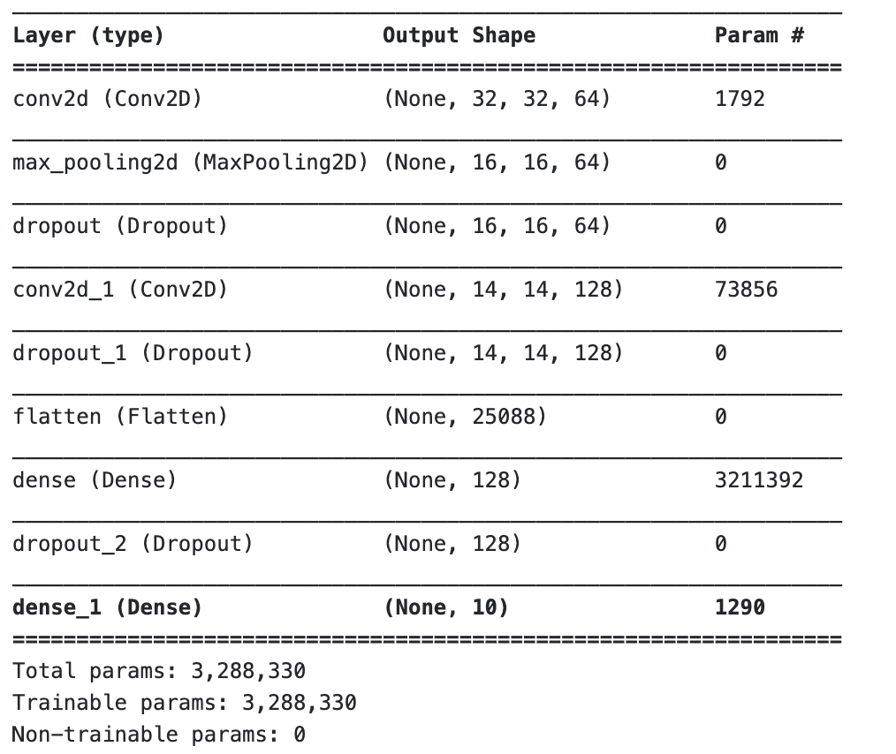
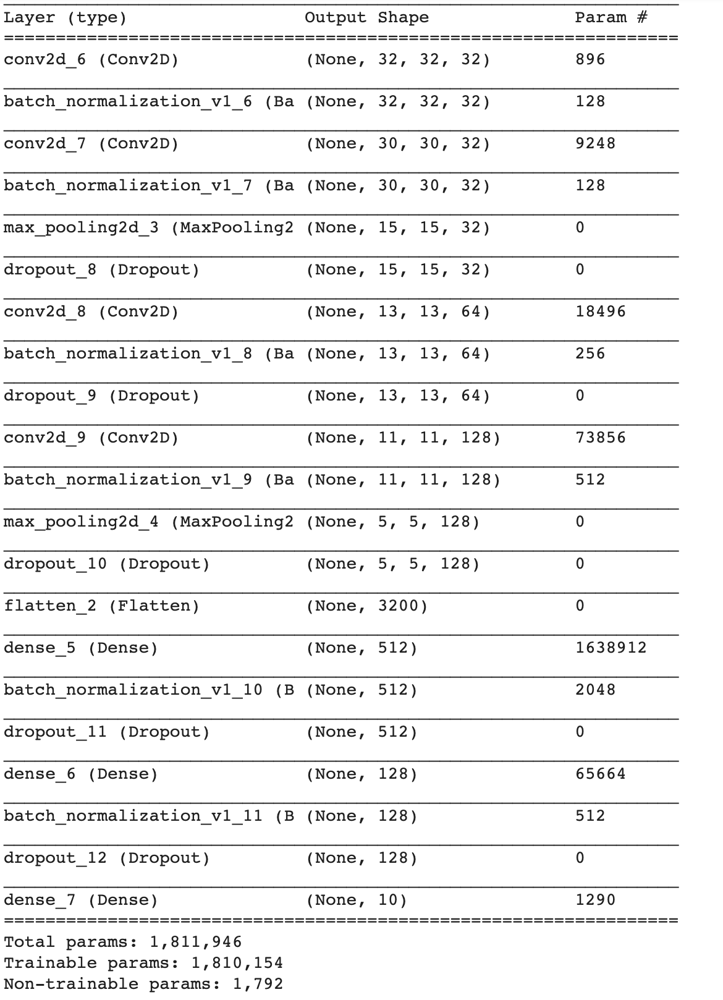

# CNN MultiClassClassifier: ComputerVision
The project implements several techniques to build CNN and classify multiple classes accurately.
1. 3-4 Layered CNN
2. Dropout & Batch Normalization

**Model1: 3-Layered CNN**
_________________________________________________________________

**Model2: 4-layered CNN with Batch Normalizationa and Dropout Technique**

input_size = (50000, 32, 32, 3)
_________________________________________________________________

**Metrics Results**

