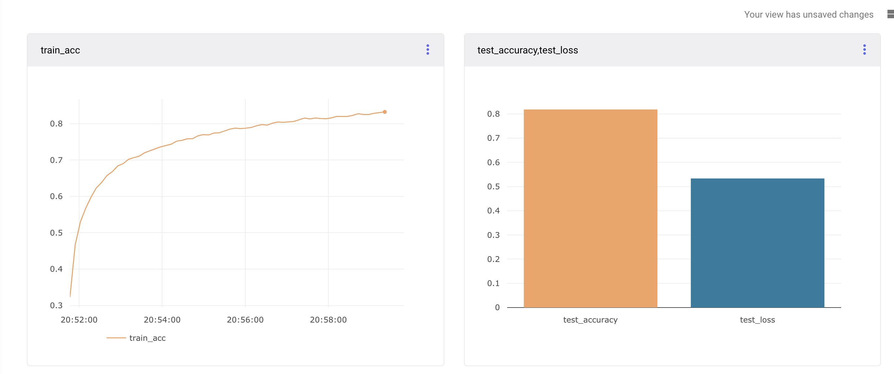
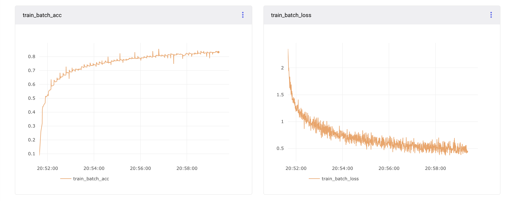
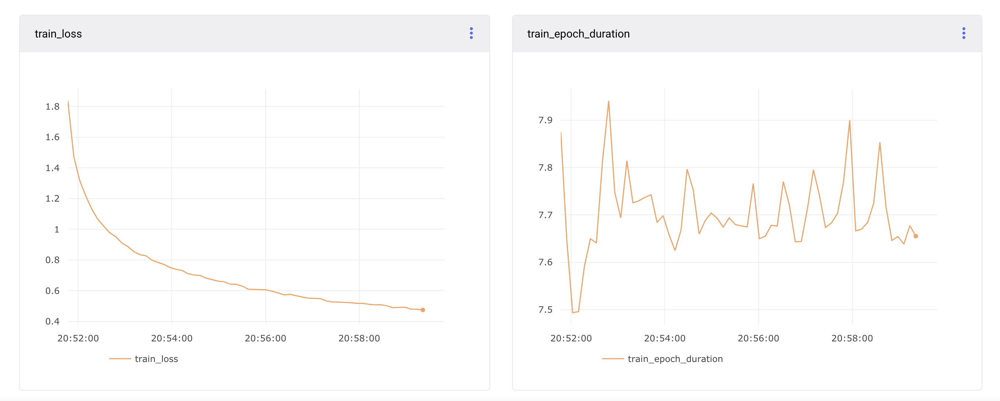
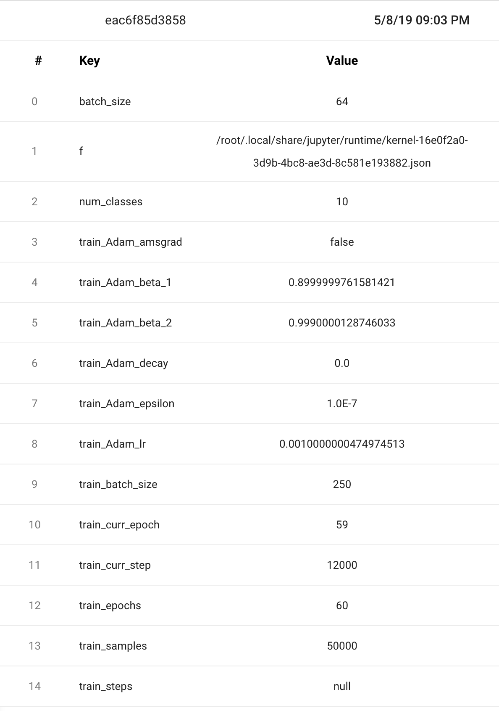

# CNN_MultiClassClassifier_ComputerVision
The project implements several techniques to build CNN and classify multiple classes accurately.
1. 3-4 Layered CNN
2. Dropout & Batch Normalization

**Metrics Results**

